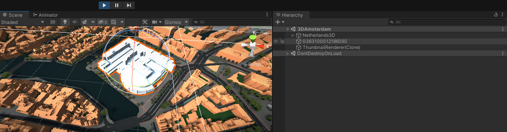
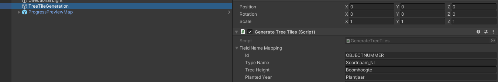

# Generating tile data assets

We have set up the Unity Project and our own municipality folder as described in [getting started](gettingstarted.md).
The next step is to set up our data generation scenes that generate the external asset files for the tile-based layers used in our Netherlands3D application:

- Buildings
- Trees
- Terrain

Because our municipality folder is created as a copy from the 3DAmsterdam folder there are already a few scenes in our *YourMunicipality*/Scenes/DataGeneration/ folder. These scenes are made to import different source files and generate unity .asset files when pressing 'Play' in the unity editor.

We will alter these scenes so they generate the files for our new municipality, starting with the Buildings:

## Buildings

Open up the *YourMunicipality*/Scenes/DataGeneration/GenerateBuildingTilesFromOBJ.scene 

You will see that it contains a ApplicationConfiguration object. Make sure the script points to the same config file we created in [getting started](gettingstarted.md), and save the scene.

Next you see that there are 3 objects in the scene with a Bag3DObjImporter script on it for different LODs(Level of detail). These practically do the same thing but use different LOD source files, so as an example we will start with generating LOD level 2.2.

Remove the two that are disabled, and select the remaining active BAG3DObjImportBuildings2.2 object so we can start setting the parameters of the import script:

| Field name                                | Field explanation                                            |
| ----------------------------------------- | ------------------------------------------------------------ |
| Bag 3D Source Files Folder                | Local folder path containing .OBJ tile files downloaded from www.3dbag.nl, for example "C:\BagObjs\\"  containing all our building models |
| Optional Skip List Path                   | An optional path to a text file, containing a list of BAG id's that you would like to skip importing. Use a newline for every bag ID you would like to skip. |
| Filter                                    | Filter for files to parse in the source files folder. By default this is *.obj, but you can specify it even more if you would like. |
| Exclusively Generate Tiles With Substring | If you fill in something here, for example an RD coordinate seperated by _, then only the tile with that substring will be generated. If you leave it open all tiles within the config boundingbox range are generated. |
| Skip Import of Objects Outside RD Bounds  | Set to True if you want the importer to skip importing objects that have no vertices inside the configurated boundingbox range |
| Lod Level                                 | This string will be used as a suffix for the generated data files, for example '2.2'. This way you can distinguish between LOD levels of different datasets in the generated asset files later on. |
| Tile Size                                 | The width and height in units of the generated tiles. Set to 1000 meter by default, which is the value used by all layers in 3DAmsterdam |
| Tile Offset                               | The offset of the origin of the generated meshes. 3DAmsterdam assets have the origin in the centre of the 1000x1000 tiles, so this is set to 500,500 by default. |
| Remove Prefix                             | The 3dbag.nl source .obj files contain building objects named by building BAG ID prefixed with 'NL.IMBAG.Pand.' We remove the prefix to retrieve the BAG ID. If your source files do not have this prefix you can leave this blank. |
| Skip Existing Files                       | If you set this to true, any existing tile assets will not be regenerated. |
| Render In Viewport                        | Set this to true if you want to show all parsed building objects in the viewport. (Only recommended for testing purposes. It will slow the editor down a lot, with unique objects for all buildings ) |
| Parse Per Frame                           | Maximum amount of .obj lines to parse per frame so the editor has a frame to show some feedback while generating. |
| Default Material                          | Default material to apply to the generated meshes.           |
| Enable On Finish                          | Optional GameObject to enable when the importer has finished. You can use this to chain multiple importers with different LOD settings. |

Save your scene after applying your settings, and press the unity editor 'Play' button to start the scene, and start importing the .obj files. 

First, the script goes through all the .obj source files and creates GameObjects for every building named by their BAG ID in the scene. This can take a while and will eat up quite a bit of system memory. Look at the console to see what stage the importer is at.

After importing all the .obj files, the script will combine the imported building GameObjects that reside inside the same tile into a single mesh per-tile. These .mesh assets will start appearing in a folder named GeneratedTileAssets. The folder will be auto-generated at that stage.
Metadata with the object seperation are saved next to the mesh data files and have a '-data' suffix.

> Tip: The unity editor is pretty choked up while generating the tiles but you can use a file explorer to inspect the contents of the /Assets/GeneratedTileAssets/ folder. There the mesh assets will appear one by one.

When the script is done, the generated asset files will need to be turned into AssetBundles.
At the top bar of the Unity editor ( next to File, Edit, etc ) select *'Netherlands 3D>Tools>Export .asset files to AssetBundles'*.

This will create the AssetBundles in the folder '/TileAssetBundles/', next to the '/Assets/' folder of the Unity project.

### Buildings: Testing our generated dataset

Upload the assetbundles to a unique folder on your webserver (for example https://example.nl/buildings/)

Now open up our project main scene and select the Buildings layer GameObject (Netherlands3D>Layers>Buildings) and change the Datasets length to 1 for now on the AssetbundleMeshLayer script (We only generated one LOD level dataset).
Change the remaining dataset description to a nice description, and change the 'Path' property so it reflect the path to the dataset on your webserver. Use '{x}'* and '{y}' as the RD coordinate placeholders in the filename. 
In case of the of the example above, this path would be 'buildings/buildings\_{x}\_{y}.2.2' and our application config file would have https://example.nl/ as a webserver root path.

Press the unity editor 'Play' button to see your building tiles appear in runtime.
If nothing appears, double-check if you set the right paths in the application config file, and the Datasets properties of the Layers>Buildings AssetbundleMeshLayer script.

### Buildings: Replacing a specific building

If you have a custom made 3D model for a specific building you can add it manually to the BAG3DObjImportBuildings scene object, and name the object with the building BAG ID, to override that imported building with the custom model.

You can determine the right location for the transform by temporarily adding the model to the main scene during playmode, positioning it, and then copying the model (Ctrl+C). 

Exit playmode, open the building generation scene and paste it inside the importer parent object. This way the transform properties of the object will be the same as the one you had during playmode:

If you now Play the generation scene the 3D Bag importer script will detect that it has a child object with an ID that already exists, and will use that model as an override for the building in the tile at that location.
You can also use this method to add new or missing buildings to the tiles.

## Terrain

Open up the *YourMunicipality*/Scenes/DataGeneration/GenerateBuildingTilesFromOBJ.scene 
You will see that it contains a ApplicationConfiguration object. Make sure the script points to the same config file we created in [getting started](gettingstarted.md), and save the scene.
next you see 1 gameObject named GenerateTerrain with a ImportTerrainScript.

Set the parameters of the import script:

| Field                      | Explanation                                                                                             |
| -------------------------- | ------------------------------------------------------------------------------------------------------- |
| Tile Size                  | the length and width of the tiles that are going to be generated                                        |
| Minimum height             | to remove spikes, points below this elevation (NAP) will be moved to the average elevation of the tile  |
| Maximum height             | to remove spikes, points above this elevation (NAP) will be moved to the average elevation of the tile  |
| GeoJSON SourceFiles Folder | Local folder path containing .json files downloaded from 3d.kadaster.nl/basisvoorziening-3d/            |

Save your scene after applying your settings, and press the unity editor 'Play' button to start the scene, and start generating the terrain. 

The script loads the json-files one by one, cuts it up into tiles, reduces the vertexcount for some parts and tries to remove spikes.
it ctreates meshes for LOD1 and LOD0.
The created meshes will start appearing in a folder named GeneratedTileAssets.
> It takes a while to create the terrainMeshes. (10-15 min. per json-file) 

When the script is done, the generated asset files will need to be turned into AssetBundles.
At the top bar of the Unity editor ( next to File, Edit, etc ) select *'Netherlands 3D>Tools>Export .asset files to AssetBundles'*.

This will create the AssetBundles in the folder '/TileAssetBundles/', next to the '/Assets/' folder of the Unity project.

### Terrain: Testing our generated dataset

Upload the assetbundles to a unique folder on your webserver (for example https://example.nl/terrain/)

Now open up our project main scene and select the Terrain layer GameObject (Netherlands3D>Layers>Terrain).
You can Change the dataset descriptions to a nice description. Change the 'Path' property so it reflect the path to the dataset on your webserver. Use '{x}'* and '{y}' as the RD coordinate placeholders in the filename. 
In case of the of the example above, these paths would be 'terrain/terrain\_{x}\_{y}-lod0' and 'terrain/terrain\_{x}\_{y}-lod1' and our application config file would have https://example.nl/ as a webserver root path.

If you want to test it without uploading the files to a server the path would be 'file://folderWhereTheAssetbundlesAre/terrain/terrain\_{x}\_{y}-lod0'

Press the unity editor 'Play' button to see your building tiles appear in runtime.
If nothing appears, double-check if you set the right paths in the application config file, and the Datasets properties of the Layers>Terrain AssetbundleMeshLayer script.

## Trees

The GenerateTreeTiles scene allows you to generate the mesh tiles for the Trees layer. 
The script spawns tree prefabs onto the terrain tiles that we created earlier ( using raycasts to determine their position in height ) based on trees data stored in .csv file(s) and combines them into tile layer assets. 

All tree prefabs share the same material and texture sheet containing 36 different trees, to speed up rendering and memory usage.
Your source file should use ';' as a separator character ad can contain the following data fields (order doesn't matter):

| Field       | Explanation                                                  |
| ----------- | ------------------------------------------------------------ |
| id          | Unique identifier for the tree.                              |
| typeName    | Description of the tree. The substrings are used to find a matching tree model from the list of prefabs. |
| treeHeight  | The tree height in meters. This is used to scale the spawned trees. This should be a string and can contain multiple numbers, for example "from 12 to 18 meters" will take the average of 12 and 18. |
| plantedYear | The year the tree was planted, for example '1995' (Not used right now) |
| radius      | The radius of the tree (Not used right now)                  |
| lng         | The longitude of the GPS coordinate (WGS84) for the position of the tree |
| lat         | The lattitude of the GPS coordinate (WGS84) for the position of the tree |

Example trees.csv file with two trees:

	id;typeName;treeHeight;plantedYear;radius;lng;lat;
	1337;"Amerikaanse linde";"12 tot 18 m.";1948;5;4.904675;52.339808;
	1338;"Honingboom";"tot 6 m.";2002;5;4.880373;52.332886;

If your .csv file fields are named differently than the field names above, you can change the mapping using the FieldNameMapping list in the inspector:

The script tries to find the best fitting tree prefab by comparing the typename value of the tree to the name of the prefabs, to see if there is a match in a substring, and places that prefab for the tree.

Make sure your references to the .csv file, and terrain tile paths are set, and press 'Play' to start generating the tree tiles.
Check out the console for the progress. At some point you will see the generated tree tiles appear in the scene view:

> The trees 3D meshes have a very low polycount and share a single material+texture to keep the tile size low and speed up the rendering
