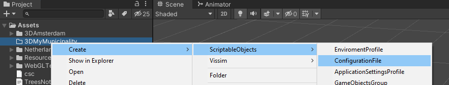
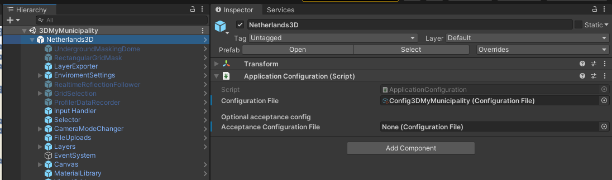

# Getting started

After opening the Unity project in the latest Unity 2020.3 LTS we want to create the root folder for our new municipality/city similar to the Assets/3DAmsterdam/ folder. 

In this example we will refer to our new folder as '3DMyMunicipality' so we create this new folder in the Assets folder:

Assets/3DMyMunicipality/

## Application config file

Now we want to add a config file that will contain our application settings.  

Right click our new 3DMyMunicipality folder and select *Create>ScriptableObjects>ConfigurationFile*. Give the config file a logical name like 'Config3DMyMunicipality'.



Now use the inspector to set the properties of our new config file:

| Field group/name                        | Field explanation                                            |
| --------------------------------------- | ------------------------------------------------------------ |
| **Bounding Box coordinates**            |                                                              |
| Relative Center RD                      | The RD x and y coordinate that will be the center ( 0,0,0 ) of our main Unity scene |
| Bottom Left RD                          | The bottom-left coordinate of our bounding-box in RD coordinates |
| Top Right RD                            | The top-right coordinate of our bounding-box in RD coordinates |
| Zero Ground Level Y                     | The NAP value that corresponds to the 0 Y value of our Unity scene |
| **Minimap Tiled Web Map**               |                                                              |
| Enable minimap                          | Enable/Disable the map on the bottom-right of the application. <br />If you do not have a tile map service that you can use you can disable it here. |
| Minimap Service URL                     | The url of your tile map service, using {zoom},{x} and {y} as placeholders for their corresponding values. |
| Minimap Tile Numbering Type             | Some map services use a different way of numbering the tiles, choose the one used by your service |
| Minimap Bottom left RD_X                | Bottom-left X coordinate of the bounding box as a RD coordinate |
| Minimap Bottom left RD_Y                | Bottom-left Y coordinate of the bounding box as a RD coordinate |
| Minimap Zoom 0RD Size                   | The size (width and height) in RD units, at zoom level 0     |
| **Tile layers external assets paths**   |                                                              |
| Webserver root path                     | The url to the path where the external assets folders and files are stored |
| Buildings Meta Data Path                | Specific url for the path where the buildings metadata files are stored |
| Sharing Base URL                        | The url for for the service that stores the shared scenes.   |
| Sharing Scene Subdirectory              | The suffix of the url above that the scene json data is posted to |
| Sharing View URL                        | The url used in combination with the unique shared scene ID's to view the scene |
| **External URLs**                       |                                                              |
| Location suggestion URL                 | The service url used for giving suggestions to a user while typing in the search field |
| Lookup URL                              | The service url returning the data for a search result when it is clicked by a user |
| **Sewerage API URLS**                   |                                                              |
| Sewerage API Type                       | Choose PDok by default. Amsterdam uses a specific api that is different to the PDOK service. |
| Sewer Pipes Wfs URL                     | The WFS url to retrieve the sewerpipe features by boundingbox. Use the suggested PDok url by default. |
| Sewer Manholes Wfs URL                  | The WFS url to retrieve the manholes features by boundingbox. Use the suggested PDok url by default. |
| **Bag API URLS**                        |                                                              |
| Bag Api Type                            | The type of BAG service Api used. Choose Kadaster by default. |
| Building URL                            | The service URL for retrieving building data by BAG id       |
| Number Indicator URL                    | The service URL for retrieving addresses tied to a BAG id    |
| Number Indicator Instance URL           | The service URL for retrieving address specific data using a BAG id |
| Monument URL                            | The service URL for retrieving monuments tied to a BAG id (Not used in the application atm.) |
| More Building Info URL                  | The URL used as a hyperlink when more information for a building is requested, using {bagid} as a placeholder for the BAG id |
| More Address Info URL                   | The URL used as a hyperlink when more information for an address is requested, using {bagid} as a placeholder for the BAG id |
| Bag Id Request Service Bounding Box URL | The mapserver API used to retrieve the BAG id's found within a bounding box used for selections. A boundingbox is appended to the url in runtime. |
| Bag Id Request Service Polygon Url      | The mapserver API used to retrieve the BAG id's found within a polygon used for selections, using a hardcoded mapserver Intersect filter. |
| Preview Backdrop Image                  | Url used by generation scenes to retrieve a satellite image using a boundingbox, to display progress information on top of it. |
| **Graphics**                            |                                                              |
| Logo                                    | Target 2D UI sprite to be used as a logo in the top left of the application |
| Primary Color                           | Color to be applied to UI items/prefabs that have a StyleColor.cs script on it set to use the Primary Color |
| Secondary Color                         | Color to be applied to UI items/prefabs that have a StyleColor.cs script on it set to use the Secondary Color |


## Scenes

Next we want to create our unity scenes. The fastest way is to copy the Scenes folder from 3DAmsterdam, and make changes to those scenes. After copying the Scenes folder to our own folder the  3DMyMunicipality folder contents should look similar to this:

```
.
├── 3DAmsterdam
├── 3DMyMunicipality                    #Our own municipality folder
|   ├── Scenes                          #The scenes folder we copied from 3DAmsterdam
|   |  ├── DataGeneration               #Folder containing data generation scenes
|   |  └── 3DMyMunicipality.unity       #Our main scene file
|   └── Config3DMyMunicipality.asset    #Our configuration file
├── Netherlands3D
├── Resources
├── WebGLTemplates      
└── csc.rsp
```

Open up our new main scene file ( 3DMyMunicipality.unity if that is what you named it )

You will see that the entire application lives inside a prefab called Netherlands3D. 
If we pull Netherlands3D updates the contents of this prefab will update with it, but any overrides to the prefab or new objects we add to our scene will remain saved in our main scene file.

Select the Netherlands3D object and target our configuration file in the ApplicationConfiguration script that is on the prefab. ( Optionally you can add an additional configuration file for an acceptation environment with different datapaths. Set that to 'None' if you do not need it )



> This is our first override to the Netherlands3D prefab that we want to save, so go ahead and save the scene file (Ctrl-S). 
> You can see the fields with an override have a blue label on the left side of the inspector.

If you already added a reference to your own logo in the config file you can press 'Play' in the unity editor and should be able to see your logo appear in the top left instead of the 3DAmsterdam logo.

Next, we want to generate and and host the datasets for the tile layers. We already copied the data generation scenes into our Scenes/DataGeneration/ folder so you are all set to continue to the explanation for: [Generating tile assets>](GeneratingTileAssets.md)
